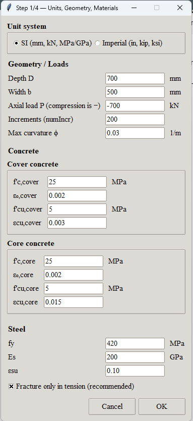
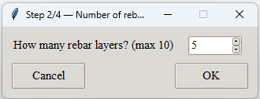
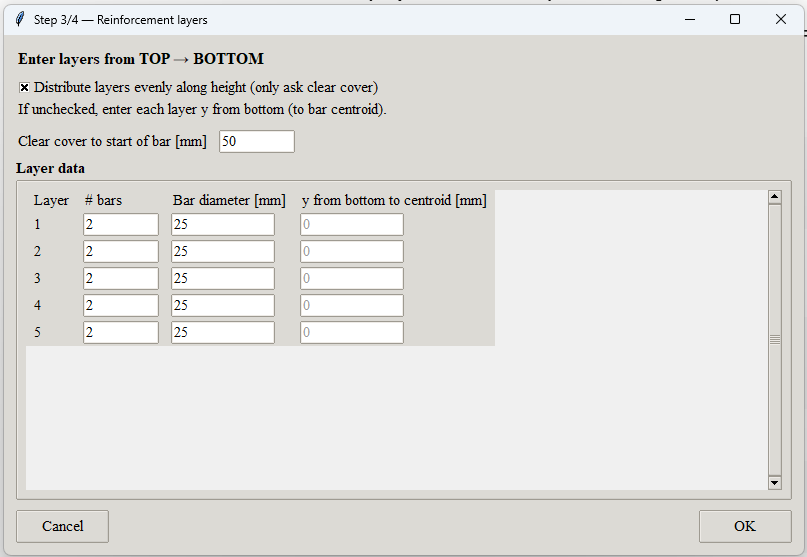

# Flecha-2026 — Moment–Curvature Analysis Tool

A lightweight **Python + OpenSeesPy** application with a **graphical user interface (GUI)** for performing **moment–curvature (M–ϕ) analysis** of reinforced concrete sections.

The tool supports:
- SI **and** Imperial units  
- Layered reinforcement definition  
- Steel yielding and fracture detection  
- Publication-ready plots (Times New Roman)  
- Optional export of results to CSV / Excel  

---

## Features

- **Interactive GUI** (Tkinter)
  - Unit system selection (SI / Imperial)
  - Geometry, material, and loading inputs
  - Reinforcement layers (manual or evenly distributed)
- **Fiber-section modeling** using OpenSeesPy
- **Steel yield detection** highlighted on the M–ϕ curve
- **Clean plotting**
  - Fiber section visualization
  - Moment–curvature curve
- **Export options**
  - Results in SI or Imperial units
  - CSV / Excel output

---

## Graphical User Interface

### Step 1 — Units, Geometry, and Materials

### Step 2 — Number of Reinforcement Layers

### Step 3 — Reinforcement Layout

---

## Output

### Fiber Section

### Moment–Curvature Curve
Steel yield is marked as a point and labeled in the legend.

### CSV File (Optional)
When enabled in the GUI, the moment–curvature results can be exported to a **CSV file**.  
The file contains curvature and moment values in either **SI or Imperial units**, consistent with the selected unit system in the interface, and is suitable for post-processing, plotting, or direct inclusion in reports.

---

## Notes

- Internally, all calculations are performed in **SI units**.
- Imperial inputs and outputs are automatically converted.
- Steel fracture is modeled using a strain-based limit (MinMax wrapper).
- The moment–curvature analysis is performed using a **zero-length section element** in OpenSees.

---

## Acknowledgements

Special thanks to **Prof. Santiago Pujol** for the original idea behind this tool.

---

## License

This project is intended for **academic and research use**.

You are free to use, modify, and extend the code for educational or research purposes.  
If you use this tool in published work, appropriate citation or acknowledgement is appreciated.

